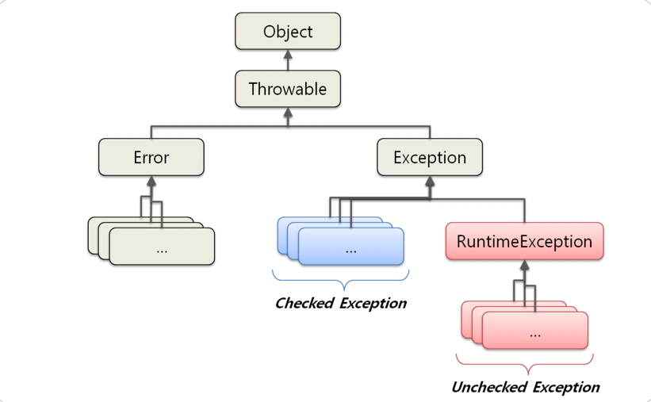

# 자바의 신

### 예외란?

자바에는 예외는 우리가 예상한, 혹은 예상치도 못한 일이 발생 하는 것을 미리 예견하고 안전장치를 하는 것이다.  
자바에서는 예상을 했던 , 안했든 예외적인 일이 발생하면 "예외" 라는 것을 던져버린다.  
예를 들어 null 인 객체에 메소드를 호출하던지, 배열의 길이보다 긴 값을 호출하던지 등등 예외상황이 오면 에외를 던진다.

---
### try - catch

설명하기 전에 배열 밖에 있는 값을 읽으려고 할 때 오류를 확인해보자.

#### 
 ArrayException 

~~~java
public class ExceptionEx {
    public void arrayOutOfBounds() {
        int[] arr = new int[5];
        System.out.println(arr[5]);
    }
    public static void main(String[] args) {
        ExceptionEx ex = new ExceptionEx();
        ex.arrayOutOfBounds();
    }
}
~~~

#### 실행결과

>  at ExceptionEx.arrayOutOfBounds(ExceptionEx.java:4) 

이렇게 ArrayIndexOutOfBoundsException 오류가 났는데 이것은 배열의 범위 밖에 있는 위치를 요청한 예외 라는 것이다. 
컴파일할 때 에러메세지가 생기는 것처럼 예외의 첫 줄에는 어떤 예외가 발생했는지 출력된다.

그렇다면 예외처리를 해서 예외 메세지를 발생시키지 않도록 해보자.

위의[코드](#arrayException)에서 해당 부분을 수정해보자.

~~~java
public void arrayOutOfBounds() {
    int[] arr = new int[5];
    try{
        System.out.println(arr[5]);
    }catch(Exception e){
        System.out.println("Error");
    }
    System.out.println("finish");
}
~~~

#### 실행결과

> Error

예외가 발생하는 부분을 try-catch 로 묶어주면 정상적으로 컴파일도 되고 실행도 정상적으로 된다.

**Q.** try 부분에서 에러가 발생되면 catch로 넘어가는 것을 확인했다. 그렇다면 try에서 오류가 없는 부분도 있다면 출력이 될까?  

~~~java
public void arrayOutOfBoundsTryCatch() {
    int[] arr = new int[5];
    try {
        System.out.println(arr[5]);
        System.out.println("try code");
    } catch (Exception e) {
        System.err.println("Exception");
    }
    System.out.println("finish");
}
~~~

#### 실행결과

>  Exception   
> finish

try문에 오류를 발견하는 즉시 catch로 넘어가 그 뒤에 있는 코드는 실행되지 않는 걸 확인할 수 있다.  
그리고, System.err.println 을 사용하면 글씨가 빨간색으로 나오게 된다.

#### 정리해보면

- try-catch 에서 예외가 발생하지 않은 경우
    - try 내에 있는 모든 문장이 실행되고 try-catch 문장 이후에 내용이 실행된다.
    
- try-catch 에서 예외가 발생하는 경우
    - try 내에서 예외가 발생한 이후의 문장들은 실행되지 않는다.  
    catch 내에 있는 문장은 반드시 실행되고, try-catch 문장 이후의 내용이 실행된다.
      
---

**Q.** catch 문에서 try 문에 선언한 변수를 사용할 수 있을까?  

위의[코드](#arrayException)에서 메소드를 추가해 보자.
~~~java
public void checkVariable() {
        try {
            int[] arr = new int[5];
            System.out.println(arr[5]);
        } catch (Exception e) {
            System.out.println(arr.length);
        }
        System.out.println("finish");
    }
~~~

#### 실행결과

 java: cannot find symbol  
symbol:   variable arr  
location: class ExceptionEx   

try 블록이랑 catch 블록이랑 다르기 때문에 오류가 났으며 오류 내용 역시 symbol 을 찾을 수 없다고 나온다.  
그렇기 때문에 , 일반적으로 catch 문장에서 사용할 변수 같은 경우 try 문장 밖에 선언한다.

**Q.** try 블록에 있던게 catch 블록에서 사용못하는 것처럼 try 블록 밖에 선언하면 안되는게 아닌가??  
**A.** 예외가 발생하여 catch 블록이 실행된다고 하여 try 의 모든 문장이 무시되는 것이 아니라 예외를 호출하는 순간 발생한다.  
그렇기 때문에 그 앞에서 실행된 문장은 전혀 문제 없이 실행된다.

---
### finally

~~~java
public class FinallyEx {
  public void finallyExample() {
    int[] arr = new int[5];
    try {
      System.out.println(arr[5]);
    } catch (Exception e) {
      System.out.println(arr.length);
    }finally {
      System.out.println("finally");
    }
    System.out.println("Done");
  }
  public static void main(String[] args) {
    FinallyEx ex = new FinallyEx();
    ex.finallyExample();
  }
}
~~~

#### 실행결과

>5  
finally  
Done

finally 블록은 예외 발생 여부와 상관없이 실행된다. try-catch 블록 이후에 코드 작성하면 되지 않나? 라는 생각이 들었지만  
코드 중복을 위해 필요하다고 책의 필자는 말한다.

---
### 두 개 이상의 catch

예외 처리를 할 때 catch 블록을 한개만 쓰는 것이 아니라 두 개 이상 사용이 가능하다.  
**Q.** 그렇다면 예외가 겹치는 경우에는 catch 블록이 모두 실행될까?

위의[코드](#arrayException)에서 해당 메소드를 추가해보자.
~~~java
public void multiCatch() {
    int[] arr = new int[5];
    try {
        System.out.println(arr[5]);
    } catch (ArrayIndexOutOfBoundsException e) {
        System.out.println("ArrayIndexOutOfBoundsException");
    } catch (Exception e) {
        System.out.println("Exception");
    }
}
~~~

#### 실행결과

> ArrayIndexOutOfBoundsException

switch 문 case 에 break 추가한거 처럼 나가는 것 같다. 그렇다면 두 순서를 바꿔보자.

#### 실행결과

> java: exception java.lang.ArrayIndexOutOfBoundsException has already been caught

이미 해당 예외처리를 했다고 오류가 나온다. 순서만 바꿨는데 에러가 난 것이다.  
이 말은 즉, Exception  ArrayIndexOutOfBoundsException 에이 포함된다는 것이다.  
자세히 말하면 java.lang.Exception 는 모든 예외 클래스의 부모이다.  
ArrayIndexOutOfBoundsException 은 Exception 의 자식 클래스다.

그렇기 때문에 범위가 큰 예외는 가장 마지막 catch 블록에 위치 하는게 맞다.

#### 정리해보면

- try 다음에 오는 catch 블록은 1개 이상 가능하다.
- 먼저 선언한 catch 블록의 에외 클래스가 다음에 선언한 catch 블록의 부모면, 자식에 속한 catch 블록은 절대 실행되지 않아 컴파일 되지 않는다.
- 하나의 try 블록에서 예외가 발생하면 그 예외와 관련이 있는 catch 블록을 찾아 실행한다.

---
### 다른 예외

- checked exception
- error
- runtime exception or unchecked exception

error 와 unchecked exception 을 제외한 모든 예외는 checked exception 이다.

---
### error

error 는 자바 프로그램 밖에서 발생한 예외를 말한다. 예를 들면 서버의 디스크가 고장 났거나, 메인보드가 정상적으로 작동하지 않거나 등등  
자바 프로그램이 제대로 동작하지 못하는 경우가 error 에 속한다.  
error 와 exception 의 가장 큰 차이는 프로그램 내부에서 발생한 것인지, 외부에서 발생한 것인지 차이다.  
더 큰 차이는 error 는 프로세스에 영향을 주고 exception 은 쓰레드에 영향을 준다.

### runtime exception

런타임 예외는 예외가 발생할 것을 미리 감지하지 못했을 때 발생한다. 런타임 예외에 해당하는 모든 예외들은 RuntimeException 을 확장한 예외들이다.  
컴파일 할 때 발생하지 않지만 실행시에는 발생할 가능성이 있는 이러한 예외를 런타임 예외 또는 컴파일시에 체크하지 않기 때문에 unchecked exception 이라고 부른다.

 [출처]https://www.nextree.co.kr/p3239/

---
### java.lang.Throwable

Exception , error 클래스는 Throwable 클래스를 상속받아 처리하도록 되어 있다.  
그렇기 때문에 exception, error 이 두가지를 처리할 때 역시 Throwable 로 처리해도 무방하다.

#### Throwable 생성자

- Throwable()
- Throwable(String message)
- Throwable(String message, Throwable cause)
- Throwable(Throwable casue)

아무런 매개 변수가 없는 생성자는 기본적으로 제공되며 , 예외 메시지를 String 으로 넘겨줄 수도 있다.  
또한 , 별도로 예외의 원인을 Throwable 객체로 넘겨 줄 수도 있다.

Throwable 클래스에 선언되어 있고, Exception 클래스에서 오버라이딩한 메소드는 많지만 가장 많이 쓰는 메소드를 살펴보자.

- getMessage()
- toString()
- printStackTrace()

---
#### getMessage()

예외 메시지를 String 형태로 제공받으며 , 예외가 출력되었을 때 어떤 예외가 발생되었는지를 확인할 때 유용하다.  
메시지를 활용하여 별도의 예외 메시지를 사용자에게 보여주려고 할 때 좋다.

---
#### toString()

예외 메시지를 String 형태로 제공받는다. getMessage() 와 다른점은 약간 더 자세하게, 예외 클래스 이름도 같이 제공한다.

---
#### printStackTrace()

가장 첫 줄에는 예외 메시지를 출력하고, 두 번째 줄부터는 예외가 발생하게 된 메소드들의 호출 관계 (stacktrace) 를 출력해준다.

예를 들면

#### 
 printStackTrace

~~~java
public class ThrowableEx {
  public void throwable() {
    int[] arr = new int[5];
    try {
      arr = null;
      System.out.println(arr[5]);
    } catch (Throwable throwable) {
      System.out.println(throwable.getMessage());
      System.out.println(throwable.toString());
      throwable.printStackTrace();
    }
  }
  public static void main(String[] args) {
    ThrowableEx ex = new ThrowableEx();
    ex.throwable();
  }
}
~~~

#### 실행결과

> null  
> java.lang.NullPointerException  
> >java.lang.NullPointerException  
 > > at ThrowableEx.throwable(ThrowableEx.java:6)  
  > > at ThrowableEx.main(ThrowableEx.java:15)  

getMessage() 를 호출 했을 때 보다 toString() 을 호출했을 때 상세하게 나오는 것을 알 수 있다.  
또한 printStackTrace() 를 쓰면 보다 자세한 메시지와 메소드 호출 정도가 출력되는 것을 볼 수 있다.

---
### throws

지금까지 예외를 처리하는 방법을 배웠다. 이제는 예외를 발생시키는 방법을 알아보자. 정확히 말하면 예외를 발생시켜는 것이다.

~~~java
public class ThrowEx {
  public void throwException(int num) {
    try {
      if (num > 12) {
        throw new Exception("Number is than 12");
      }
      System.out.println("Number is " + num);
    } catch (Exception e) {
      e.printStackTrace();
    }
  }

  public static void main(String[] args) {
    ThrowEx ex = new ThrowEx();
    ex.throwException(13);
  }
}
~~~

#### 실행결과

> java.lang.Exception: Number is than 12  
>   at ThrowEx.throwException(ThrowEx.java:5)  
>   at ThrowEx.main(ThrowEx.java:15)

if 조건에 맞으면 throw 로 던져 catch 블록으로 이동하게 되는데 예외로 던지면 밑에 문장은 실행되지 않는다.  
e.printStackTrace() 를 실행시켜 보니 에외 메세지에 throw 로 던진 메세지가 그대로 출력되는 것을 확인 할 수 있다.

예외가 발생했을 경우 굳이 try-catch 로 묶지 않아도 예외 처리를 할 수있다.

위의[코드](#stacktrace)에서 해당 부분을 수정해보자.

~~~java
public class ThrowEx {
    public void throwException(int num) throws Exception {
        if (num > 12) {
            throw new Exception("Number is over than 12");
        }
        System.out.println("number is " + num);
    }

    public static void main(String[] args) throws Exception {
        ThrowEx ex = new ThrowEx();
        ex.throwException(13);
    }
}
~~~

#### 실행결과

>Exception in thread "main" java.lang.Exception: Number is over than 12  
at ThrowEx.throwException(ThrowEx.java:4)  
at ThrowEx.main(ThrowEx.java:11)

try-catch 블록으로 묶지 않아도 예외를 throw 한다고 할지라도, throws 가 선언되어 있기 때문에 전혀 문제없이 컴파일 및 실행이 가능하다.  
하지만, throws 로 메소드를 선언하면 개발이 어려워진다.  
이유는 throwsException() 이라는 메소드는 Exception 을 던진다고 메소드 선언부에 throws 선언을 했기 때문에, 
throwsException() 메소드를 호출한 메소드에는 반드시 try-catch 블록으로 throwsException() 메소드를 감싸주어야한다.

만약 그렇지 않은 경우에는 어떻게 에러가 날까?

#### 실행결과
> java: unreported exception java.lang.Exception; must be caught or declared to be thrown

caught 되거나 throw 한다고 선언해야 한다고 나와있다.  
이전에 throw 구문으로 선언되어 있는 메소드를 호출한 메소드 에서 try-catch 로 호출부분을 감싸야 한다고 위의 내용에 나와있다.  
그러므로 에러가 생긴것이다.

이러한 throws 문장으로 인한 컴파일 오류가 생겼을 경우에는 두 가지 방법이 있다.

1. try-catch 로 묶는 방법이다.
2. 호출한 메소드에서도 다시 throws 해버리면 된다.

1번이 일방적인 방법이지만 2번 방법은 이미 throws 한 것을 다시 throws 하는 것은 좋은 방법은 아니다. 
가장 좋은 방법은 throws 를 호출하는 메소드에서 try-catch 로 처리하는 것이다. 

---
#### 정리

- 메소드를 선언할 때 변수 소괄호 뒤에 throws 예약어를 적어 준 뒤 예외를 선언하면 
헤당 메소드에서 선언한 예외가 발생했을 때 호출한 메소드로 예외가 전달된다.  
  만약 메소드에서 두 가지 이상 예외를 던지려면 콤마로 구반하여 예외 클래스 이름을 적어주면 된다.

- try 블록 내에서 예외를 발생시킬 경우에 throw 라는 예약어를 적어 준 다음 예외 객체를 생성하거나 생성되어 있는 객체를 명시해준다.  
그렇지 않은 경우 컴파일 에러가 발생한다.
  
- catch 블록에서 예외를 throw 할 경우에는 메소드 선언의 throws 구문에 해당 예외가 정의되어 있어야만 한다.

### 예외 만들기

Exception 을 처리하는 예외 클래스는 개발자가 임의로 Throwable 이나 자식 클래스의 상속을 받아 추가해서 만들 수 있다.  
Exception 을 처리하는 클래스라면 java.lang.Exception 클래스의 상속을 받는 것이 좋다.

#### 
 exception 

~~~java
public class CustomException {
    public void throwException(int num)throws MyException {
        try {
            if (num > 12) throw new MyException("Num is over than 12");

        } catch (MyException e) {
            e.printStackTrace();
        }
    }

    public static void main(String[] args) {
        CustomException exception = new CustomException();

        try {
            exception.throwException(13);
        } catch (MyException e) {
            e.printStackTrace();
        }
    }
}
~~~

#### 실행결과

>MyException: Num is over than 12  
at CustomException.throwException(CustomException.java:4)  
at CustomException.main(CustomException.java:15)

직접 만든 예외를 던지고, catch 블록에서 사용가능하다. 컴파일에 문제도 없고 , 예외 메시지도 정상적으로 밣생한다.  
main 메소드에서는 MyException 말고도 Exception 을 던져도 무관하다.

하지만 , MyException 이 예외 클래스가 되려면 Throwable 클래스의 자식 클래스가 되어야한다.  
만약, MyException 을 선언할 때 관련된 클래스를 확장하지 않았을 때에는 이 부분에서 제대로 컴파일이 되지 않는다.
즉, 예외 클래스라는 것을 임의로 만들 때 반드시 Throwable 의 직계 자손 클래스를 상속받아 만들어야 한다.

---
