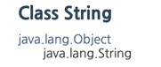
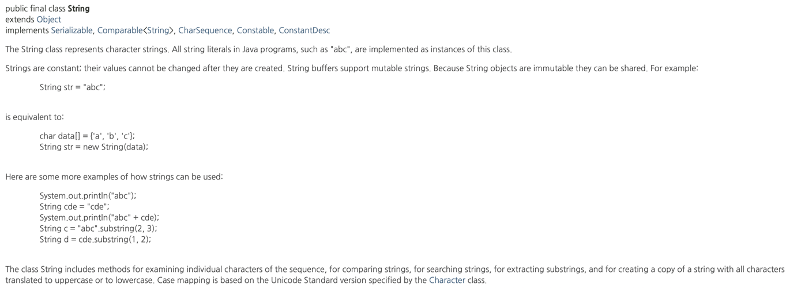
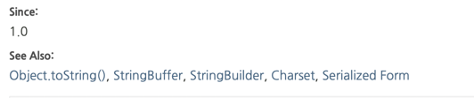

# 자바의 신

### API란?

Application Programming Interface의 약자로 "애플리케이션에 선언되어 있는 클래스와 메소드에 대한 상세한 설명이 포함된 문서" 를 뜻한다  
자바의 API는 HTML로 구성되어 있으며, 쉽게 API 문서를 찾아볼 수 있다. 

**Q.** 어떻게 API를 사용할 수 있을까??  
**A.** 우리가 자바를 개발할 때 API 문서를 별도로 작성할 필요가 없다.

소스 내에 클래스 및 메소드를 선언하기 전이나 후에 API에 명시되도록 하기 위한 주석만 상세하게 달면 된다고 이 책의 필자가 말해주고 있다. 

### [java.lang](https://docs.oracle.com/en/java/javase/15/docs/api/java.base/java/lang/package-summary.html)

해당 사이트에 들어가게 되면 java.lang 패키지에 대한 내용이 나오게 된다.  
좌측 하단에 있는 클래스 목록 화면의 순서는 다음과 같다.

> - 인터페이스 목록
> - 클래스 목록
> - Enum 클래스 목록
> - 예외 클래스 목록
> - 에러 클래스 목록
> - 어노테이션 타입 목록

인터페이스, 클래스 등등 어떤 것을 클릭해도 우측의 창에 선택한 타입에 대한 자세허나 설명이 제공 된다.

### 클래스 및 인터페이스 상세 정보 화면 살펴보기

사이트에 여러가지 정보가 있는데 그 중 String 클래스를 예로 들어서 알아보면

 String 

 

이 클래스가 어떤 클래스들의 상속을 받았는지 관계를 계단식으로 보여준다. 
그림을 참조해 보면 java.lang 패키지의 Object 클래스에서 상속받은걸로 확인이 된다.  
또한, final 클래스 이기 때문에 더 이상 자식을 가지지 못한다.

---
#### 구현한 모든 인터페이스 목록 및 클래스 / 인터페이스 선언 상태

해당 [그림](#String)에 보면 String 클래스의 구현한 모든 인터페이스 목록이 구현되어 있을 것이다.  
또한 클래스가 어떤 접근 제어자를 사용했는지, final 클래스인지 등을 확인할 수 있다.

#### 클래스 / 인터페이스 설명

해당 그림 처럼 클래스에 대한 상세한 설명을 볼 수 있다.  

여기서 중요한게 Since, See Also 부분 이다.  
Since는 해당 클래스가 JDK에 추가된 버전이 명시되고, 
SeeAlso는 그 클래스와 관련되어 있는 클래스 , 인터페이스 , 메소드 등등 링크가 제공되는데 해당 링크에 관련 정보가 들어가있기 때문에 유용하게 사용가능하다.

---
### Summary

> - 내부 클래스 종합
>   - 자바는 클래스 안에 내부 클래스를 선언하여 가능한데 내부 클래스를 public 하게 선언한 경우 그에 대한 내용이 목록에서 제공된다.
> - 상수 필드 종합
>   - public static으로 선언한 상수 필드를 어떤 값에 주로 선언하는지 알 수 있다. ex) java.util.Calendar
> - 생성자 종합
>   - 클래스에 어떤 생성자들이 선언되어 있는지 목록으로 제공하며, 어떤 생성자가 있는지 한눈에 볼 수 있다.
> - 메소드 종합
>   - 클래스에 선언되어 있는 모든 public 및 protected 메소드에 대한 종합 정보를 제공한다. 
      > 어떤 메소드가 있는지 쉽게 확인 가능하며, 리턴타입은 어떤 것인지 매개 변수로는 어떤 것을 넘겨 줘야 하는지 확인이 가능하여 아주 유용하다.
      또한 static 타입 메소드들은 static이 추가로 명시되어 있기 때문에 확인이 가능하다.

**Q.** 그렇다면 왜 public , protected 접근 제어자만 API에 표시되는 걸까?  
**A.** 두 접근 제어자 모두 상속에 관련되어 있다. 해당 클래스로 상속받아 자식 클래스를 개발할 때 어떤 메소드가 있는지 알아야 하기 때문이다.

그 밖에도 부모 클래스로부터 상속받은 메소드들 , 상수 필드 상세 설명 , 생성자 상세 설명 , 메소드 상세 설명 등 여러가지가 확인 가능하다.