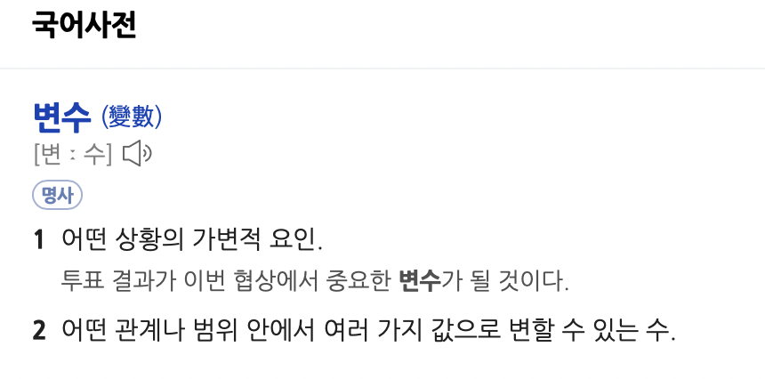

# 자바의 신

## 변수란?
어떤 프로그래밍 언어를 사용하든 간에, 내용을 어디에는 담아야하는데 담아 두는 것을 변수라고 한다.

그러면 아래와 같은 코드에서는 변수가 몇개일까??

~~~java
public class Calculator{
    public static void main(String[] args) {
        System.out.println("Calculator class");
        Calculator calculator = new Calculator();
        
        int a = 10;
        int b = 5;
    }
}
~~~
 

이 책을 접하기 전에는 calculator, a, b 정도로만 생각했다. 
main 메소드의 선언문을 보면 String[] args 라는 것이 있는데 역시 변수이다. 
우선 변수의 정의는 정확하게 무엇일까??

국어사전에 이렇게 설명해주고 있다.

그렇다면 자바에서는 변수의 종류가 어떠한 것이 있을까??? 
 책에서는 다음과 같이 설명한다.

>- 지역 변수 ( local variables )
>  - 중괄호 내에서 선언된 변수
> 
> 
>- 매개 변수 ( parameters )
>  - 메소드에 넘겨주는 변수
>  - 메소드가 호출될 때 생성되며, 메소드가 끝나면 소멸된다.
> 
> 
>- 인스턴스 변수 ( instance variables )
>   - 메소드 밖에, 클래스 안에 선언된 변수. 앞에는 **static**이라는 예약어가 없어야한다.
>   - 객체가 생성될 때 생성되며, 객체를 참조하는 것이 따로 없으면 소멸된다.
> 
> 
>- 클래스 변수 ( class variables )
>   - 인스턴스 변수처럼 메소드 밖에, 클래스 안에 선언된 변수 중에서 타입 선언 앞에 **static**이라는 예약어가 있는 변수
>   - 클래스가 처음 호출될 때 생성되며, 프로그램이 끝날 때 소멸된다.

여기까지 변수의 종류를 알아보았다. 그렇다면? 변수를 만드는 규칙은 어떻게 되는 것 일까??
 책에서는 다음과 같이 설명한다.

> * 길이의 제한은 없다.
> 
> 
> * 첫 문자는 유니코드 문자, 알파벳, $, _ 만 올 수 있다. 그렇지만 $, _ 를 일반적으로 먼저 사용하지는 않는다.
> 
> * 두 번째 문자부터는 유니코드 문자, 알파벳, 숫자, $, _ 중 아무거나 사용가능하다.
> 
> 
> * 일반적으로 메소드 이름처럼 지정해서 사용한다. ex) hashCode, toUpperCase 처럼 첫 문자는 소문자,
> 두번째의 첫문자만 대문자를 사용하면 된다.
> 
>
> * 상수의 경우에는 모두 대문자로 지정하며, 단어와 단어 사이에는 _로 구분한다.
> 

### 기본 자료형과 참조 자료형이란??

~~~java
public class Main {
    public static void main(String[] args) {
        Calculator calculator = new Calculator(); // 참조 자료형
        int number = 10; // 기본 자료형
    }
}
~~~

**차이점 :** 참조 자료형은 new라는 예약어르 통하여 초기화를 해야하는 자료형이며, 기본 자료형은 그렇지 않고 바로 초기화가 되는 자료형이다. 
**String**은 제외한다.

그럼 예약어 new를 통하여 초기화를 따로 진행하지 않는 기본 자료형들의 초기값은 무엇일까??

> byte : 0 
> short : 0 
> int : 0 
> long : 0 
> float : 0.0 
> double : 0.0 
> char : 아무것도 없는 것으로 나오지만 실제로는 \u0000 출력된 것이다. 
> boolean : false

>그렇지만 저자는 반드시 기본값을 할당하는 코딩 버릇을 들여 주기 바란다고 말한다.

### 정리해 봅시다.

* 